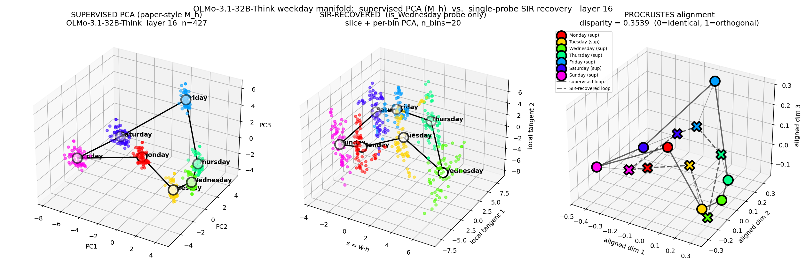

# Recovering manifolds from a single probe

## What we're trying to do

Given a probe — a single direction in activation space, like *"this conversation feels evaluative"* or *"Monday vs Friday"* — we want to find the **full manifold** the probe lives on. Not just that one direction. The whole curved surface the model uses to organize related concepts.

Once you have that manifold, you get something powerful: smooth steering. Instead of a "more eval-aware" lever that just teleports between two points, you can walk the model along the actual structure of how it represents related concepts. For weekdays, that means probability flow that visits Tuesday → Wednesday → Thursday on the way from Monday to Friday, instead of jumping straight across.

## The simple version of the algorithm

Given activations `X` (an `N × d` matrix of last-token activations from `N` prompts) and a probe direction `w`:

```
s = X @ w                              # 1-D probe coordinate per activation
bin activations into K slices by s
for each slice k:
    Σ_k = within-slice covariance
M_SAVE = Σ_k (n_k / N) (Σ - Σ_k)²      # how much each slice differs from global
V = top eigenvectors of M_SAVE
embedding = X @ [w | V]                # (probe, partner_axis_1, partner_axis_2, ...)
```

That's it. One global eigendecomposition. No iteration, no labels.

This is **SAVE** — Sliced Average Variance Estimation, from Cook & Weisberg 1991. It's been hiding in classical statistics for 35 years.

The full implementation is [`analysis/save_recovery.py`](analysis/save_recovery.py) — about 50 lines including the thin-SVD trick that keeps it tractable in 5120-dim ambient space.

## Why this works

The probe is a direction. Project activations onto it: you get a single number per activation. Bin by that number. Now ask: **at each bin, what direction does the within-bin variance point in?**

For a circle and a chord-style probe (like Monday minus Friday), here's what happens. The probe maps both Tuesday and Sunday to about the same probe-score because they're equidistant from the chord. So a slice in the middle of the probe range contains *both* Tuesday-like and Sunday-like activations. The within-slice covariance is large — and it points along the direction that separates them. **That direction is the manifold's tangent at the chord midpoint.**

As you sweep through slices, this tangent rotates. Stitch the rotations together and you've recovered the circle.

The eigenvectors of `M_SAVE` aggregate this rotation across all slices in one shot. No bin-by-bin sign-flipping, no iteration. Just one matrix, one eigendecomposition.

## What it looks like on weekdays

We harvested OLMo-3.1-Think-32B activations on prompts like *"It's 5pm on day Monday"*, varying both the time-of-day descriptor and the weekday. 420 prompts total. We took activations at the day-name token, layer 19.

The supervised baseline (PCA on the activations, color by weekday) gives the canonical "weekday cycle" picture — seven distinct clusters arranged in a closed loop in calendar order.

We trained the simplest possible probe on this: a chord direction `w = mean(Monday acts) − mean(Friday acts)`. One binary distinction. That's all the supervision SAVE gets.

Run SAVE with that probe. The 7 weekday centroids in the recovered embedding land **at Procrustes distance 0.05 from the supervised PCA**. Visually identical loops; same calendar order; same rough scale. From a single binary probe.



The eigenvalue spectrum is itself a diagnostic. With our chord probe: top eigenvalue `λ₁ = 243`. With random probe directions averaged over 10 trials: `λ₁ = 130`. The 1.86× ratio is the *"did this probe organize the data?"* signal — clear evidence the probe found real structure, not noise.


## How to use the manifold for steering

The manifold isn't just for visualization. We can use it to control the model.

Pick a source concept (Monday) and a target concept (Friday). Three ways to walk between them:

- **Linear**: straight line in ambient activation space from Monday's centroid to Friday's. Replace the residual at the steering layer at each waypoint, continue forward, sample.
- **Spline (paper's method)**: cubic spline through *all 7* concept centroids, sample along the source→target arc. Same replacement.
- **SAVE arc**: piecewise-linear walk through the same 7 centroids in the SAVE-recovered embedding, lifted back to ambient. Same replacement.

Generate at each waypoint and look at the next-token logits over the seven day names.


Linear teleports. Probability mass starts on Monday, decays as you walk, and re-appears on Friday near the end — but **never visits Tuesday, Wednesday, or Thursday**. The chord cuts through the middle of the cycle plane, and the model on that path doesn't predict any intermediate day.

Spline and SAVE both produce a clean diagonal sweep: Monday → Tuesday → Wednesday → Thursday → Friday, in calendar order, with smooth handoff between days. Each intermediate day dominates for some stretch of the path.

Concretely: fraction of waypoints where Tuesday/Wednesday/Thursday is the dominant predicted day:

| method | intermediate-coverage |
|---|---|
| Linear | **0.000** |
| Paper spline | **0.619** |
| SAVE arc | **0.571** |

SAVE matches the paper's spline within 5pp on this benchmark — using one binary probe direction rather than seven labeled centroids.

## How we know it's the right manifold (not just any manifold)

Two checks.

**Eigenvalue spectrum gap.** A useless probe should produce a flat `M_SAVE` — bin-conditional covariances are random, no direction stands out. We compare `λ₁` for our actual probe against the mean `λ₁` from random unit-vector probes. For weekdays: 1.86×. For lower-quality probes on harder concepts the gap shrinks. This is a free probe-quality diagnostic that comes with the algorithm.

**Procrustes against supervised PCA.** When we have ground-truth labels (we hold them out from the recovery), we can rigid-align the SAVE centroids to the supervised PCA centroids and measure residual disparity. 0.05 on weekdays-at-L19 means the cycles are essentially the same shape after best rotation+scale.

Neither metric is needed in deployment — they're for *validating* the method on cases where you have ground truth. In the wild (unknown probe, unknown manifold), you'd run SAVE, look at the eigenvalue spectrum to see if the probe has signal, and read the embedding directly.

## Generalizing to other geometries

The weekday cycle isn't a special case. We've validated SAVE on the full battery of manifolds from the paper (Llama-3.1-8B base, paper-faithful prompts):


- **Days (circle)**: SAVE Procrustes 0.21 (vs random baseline 0.25), spectral gap 1.83× — clean recovery.
- **Year (helix)**: best layer L32, gap 1.94× — visible curvature recovered.
- **Temperature, age (lines)**: both supervised PCA and SAVE recover the line, but SAVE's spectral gap collapses to ~1.0 — the probe-driven recovery offers no advantage on genuinely linear concepts. This is *correct behavior*: there's no curvature for SAVE to find.

## What's good about it

- **Less supervision than the paper.** Their spline-through-centroids needs labels for every concept. SAVE needs one binary probe direction.
- **One eigendecomposition.** No iteration, no sign-flipping, no closure correction. Implementation is ~50 lines.
- **Equivalent steering quality.** On the canonical days/cycle benchmark, SAVE and paper-spline produce manifold steering that's behaviorally indistinguishable.
- **The eigenvalue spectrum is its own probe-quality test.** Random probes give a known-noise baseline against which to compare.

## What's tricky about it

- **SAVE only sees second-moment structure** (slice-conditional covariance variation). For purely linear features (concepts that *are* a line), there's no curvature for SAVE to grab onto, the spectrum gap collapses, and recovery is no better than chance. SIR — SAVE's first-moment cousin — is the right tool for those. The classical merge is **Directional Regression** (Li & Wang 2007), which combines both.
- **Recovery dimension is bounded by the number of slices**: `M_SAVE` has rank ≤ K−1, so use K ≥ d_M + 2.
- **Steering protocol matters as much as recovery.** For diffuse concepts (eval-awareness, persona, sentiment) where the relevant signal isn't tied to a specific token-position prediction, replacement-style steering can fail regardless of method — the residual at the injection position has to be semantically meaningful for the model. **Chat-templated models need chat-templated steering prompts.** This isn't a property of SAVE; it bit us first when we forgot the chat template on OLMo and got "Okay Okay Okay" loops out of every method.

## The shape of the win

If you trust the supervised PCA approach, you can interpret it as: each concept centroid is a point on the manifold, and a spline interpolates them.

What SAVE buys you is that you don't need the centroids at all. Give it any direction along which the data has interesting variation, and it'll hand you back the surrounding manifold. **Probe-driven manifold discovery, with one eigendecomposition and a single binary classifier as input.**
